# Thông tin sinh viên

- **Họ và Tên:** Nguyễn Hồng Đăng
- **MSSV:** 23810310039
- **Lớp:** D18CNPM01

# Mô tả chức năng

Khi người dùng Login, thêm sản phẩm vào My Cart, hay thực hiện Checkout thì hệ thống sẽ đều lưu lại vào `AsyncStorage`

Thông tin đơn hàng được lưu dưới đạng JSON (nhưng không lưu lại ảnh). Sau khi người dùng mở lại app sẽ thực hiện lấy data ở `AsyncStorage` để tự động đăng nhập và hiển thị thông tin giỏ hàng, đơn hàng

Khi lấy thông tin của đơn hàng, ứng dụng sẽ tự động mapping các trường cần thiết để khôi phục và hiển thị lại thông tin sản phẩm đầy đủ (không bao gồm ảnh lưu thô)

**Chức năng mở rộng:**

- Thêm chức năng **mã hoá dữ liệu** (với thông tin orders và user) để bảo mật
- Thêm chức năng **tự động hết hạn login** (sau 10s hoặc 1 phút không tương tác được thiết lập trong source), sau khoảng thời gian đó user sẽ bị buộc phải login lại (chức năng logout tự động này sẽ xoá sạch hoàn toàn thông tin người dùng khỏi storage)
- Thêm **hiệu ứng loading (Loading / Skeleton)** khi tải dữ liệu với các card sản phẩm và spinner trong khi gửi request AUTH

# Hướng dẫn chạy app

1. Đảm bảo đã thiết lập NodeJS trên máy tính, clone folder dự án về thiết bị
2. Mở Terminal tại thư mục gốc của project (nơi có chứa file `package.json`)
3. Chạy lệnh để thiết lập các mô đun phụ thuộc nếu chưa cài đặt:

   npx expo@54 install

4. Khởi chạy server development bằng Expo:

   npx expo start -c

5. Quét mã QR code xuất hiện trên terminal bằng ứng dụng **Expo Go** trên Android/iOS để trải nghiệm trực tiếp trên điện thoại thực, hoặc bấm phim tắt (ví dụ `a` cho Android emulator, `i` cho iOS simulator)

# câu hỏi

**1. AsyncStorage hoạt động như thế nào?**

- AsyncStorage hoạt động bằng cách lưu data vào bộ nhớ thiết bị cục bộ và khi dùng thì lấy thông tin lên để sử dụng lại

**2. Vì sao dùng AsyncStorage thay vì biến state?**

- Sử dụng AsyncStorage thay cho biến state vì biến state chỉ có vòng đời tồn tại giới hạn trong lúc app đang chạy. Nếu app dừng hoạt động thì dữ liệu lưu trong biến state cũng mất

**3. So sánh với Context API:**

- AsyncStorage và Context API khác nhau chủ yếu ở lưu trữ và mục đích tiếp cận sử dụng
- **AsyncStorage**: Thời gian lưu trữ lâu và có thể lưu tồn tại dai dẳng để lấy data sử dụng lại kể cả khi app tắt và mở lại
- **Context API**: Hoạt động như một bản nâng cấp của biến state, là nơi lưu trữ trạng thái nằm trên RAM. Việc này giúp mọi nơi trên app khi muốn truy cập đến một dữ liệu nào đó thì chỉ việc lấy ra mà không cần phải truyền props phức tạp giữa các Component với nhau nhưng thời gian sống cũng hết khi mà kill app

# Ảnh / Video Demo

### Video Demo

[Xem Video Demo](./ScreenShots/23010310039_01_DemoVideo.mp4)

### Ảnh Demo Screens

_(Dưới đây là hình ảnh toàn bộ các màn hình đã phát triển trong ứng dụng)_

| 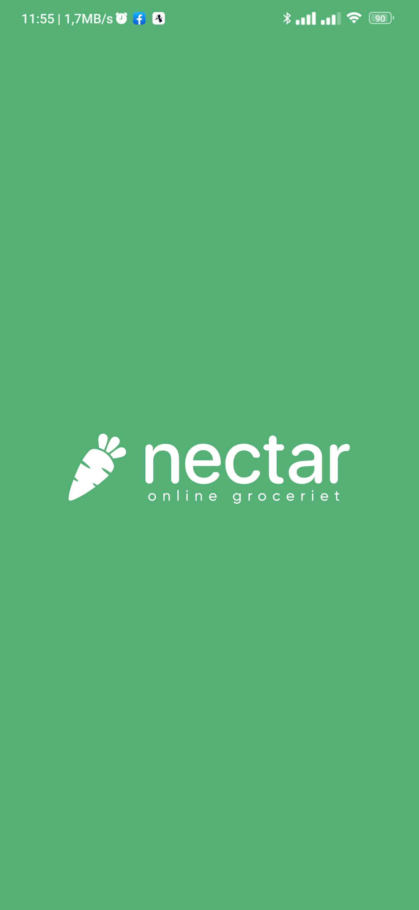 | 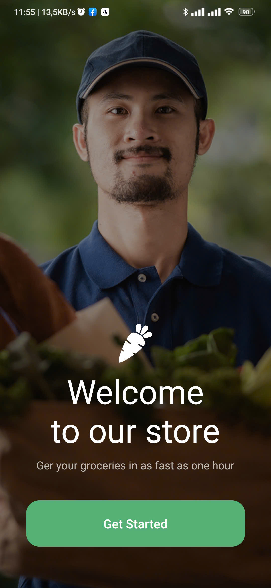 | 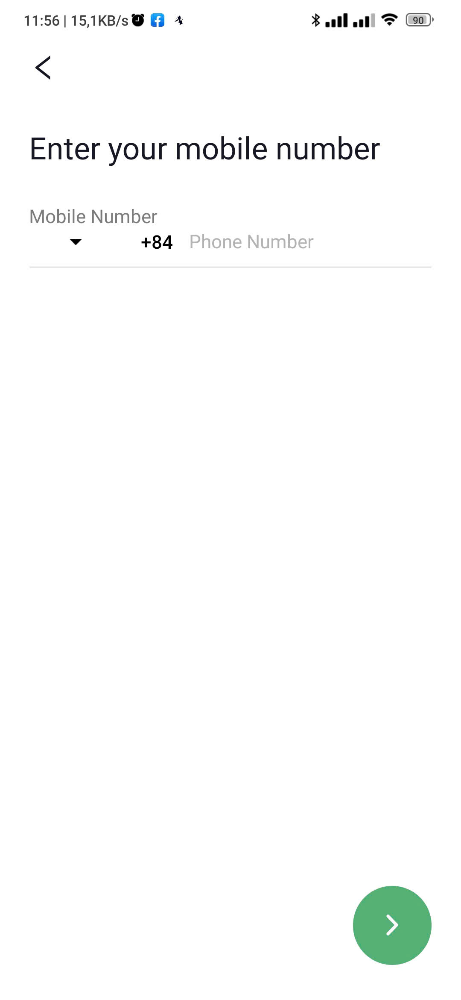 |
| :----------------------------------------------------------------------: | :--------------------------------------------------------------------------: | :--------------------------------------------------------------------------: |
|                              Splash Screen                               |                              Onboarding Screen                               |                             Number Input Screen                              |

| 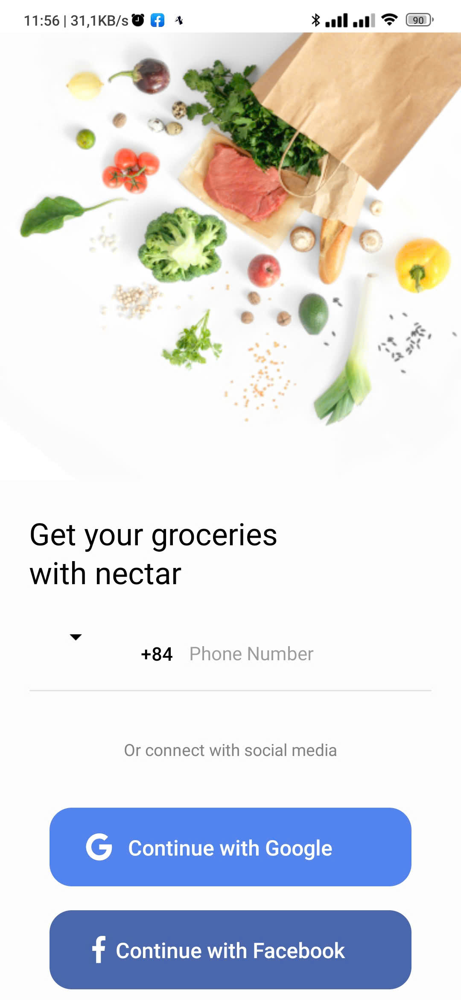 | 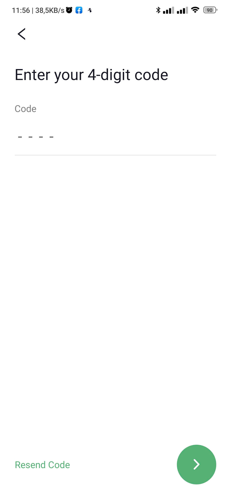 | 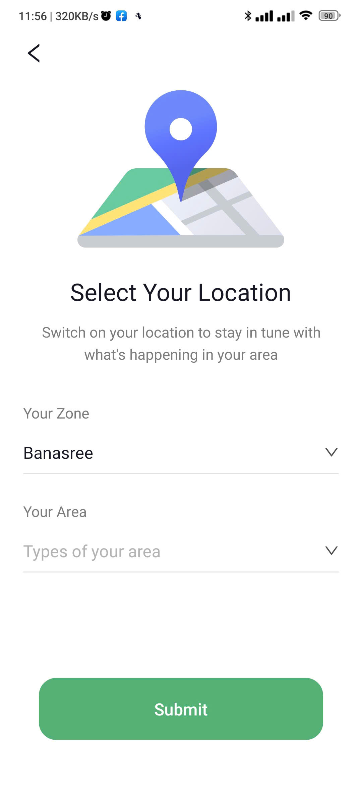 |
| :---------------------------------------------------------------------: | :---------------------------------------------------------------------: | :-----------------------------------------------------------------------: |
|                             Sign In Screen                              |                           Verification Screen                           |                          Select Location Screen                           |

| 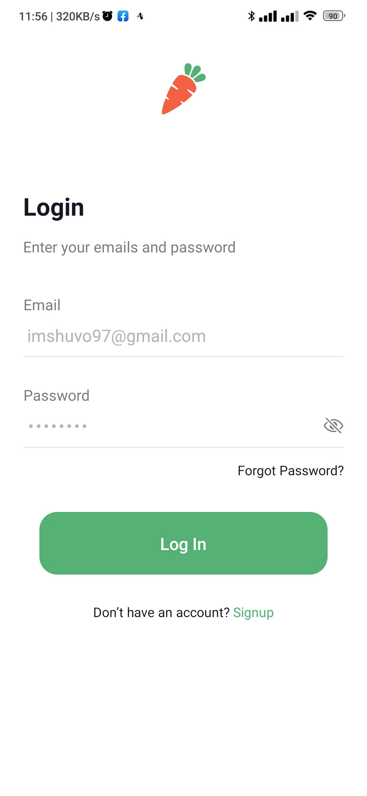 | 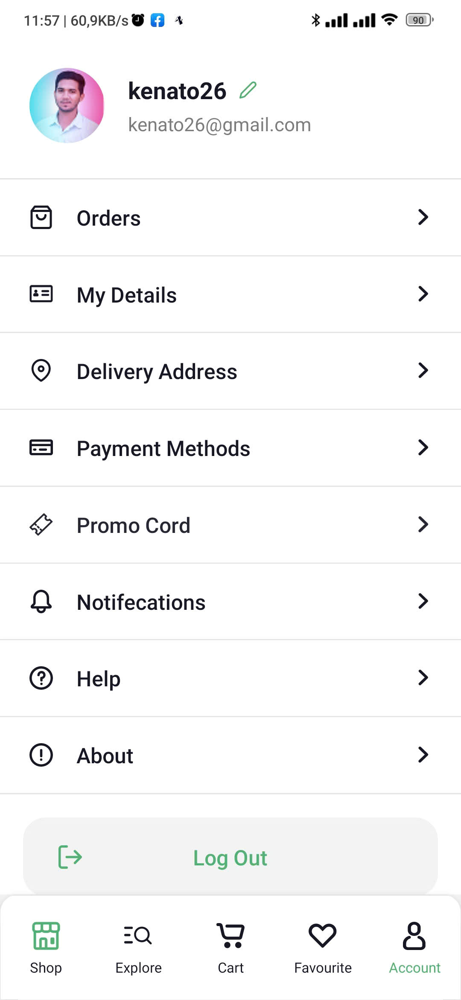 | 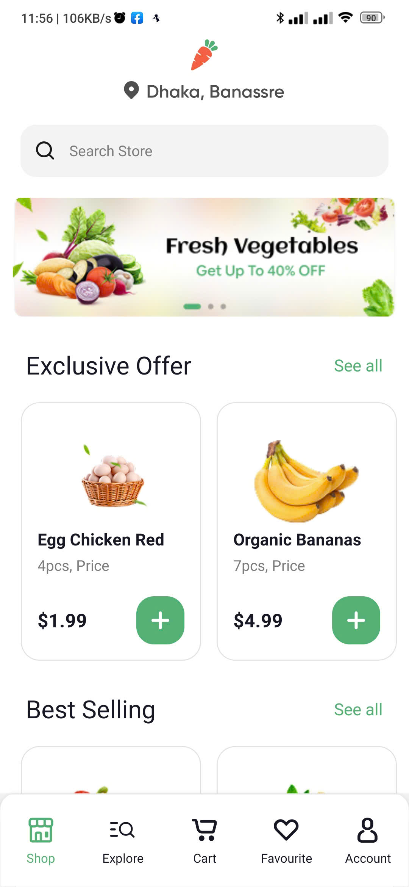 |
| :--------------------------------------------------------------------: | :---------------------------------------------------------------------: | :-------------------------------------------------------------------: |
|                              Login Screen                              |                             Sign Up Screen                              |                              Home Screen                              |

| 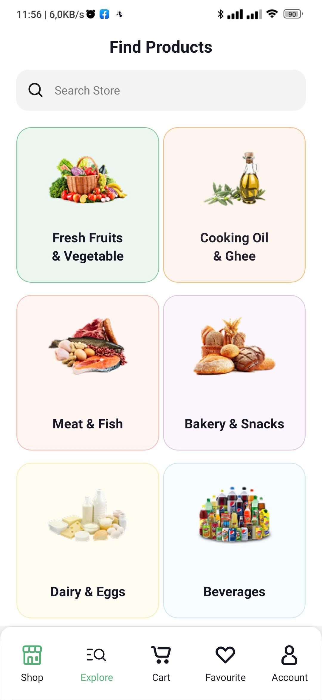 |  | 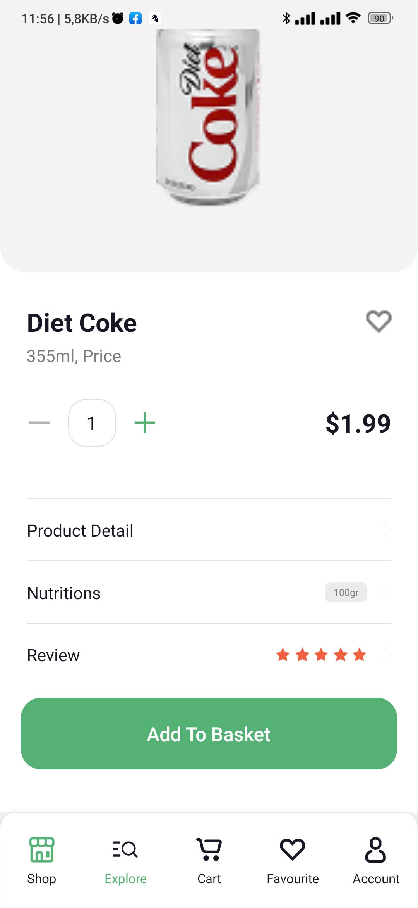 |
| :----------------------------------------------------------------------: | :-------------------------------------------------------------------------: | :----------------------------------------------------------------------------: |
|                              Explore Screen                              |                              Beverages Screens                              |                             Product Detail Screen                              |

| 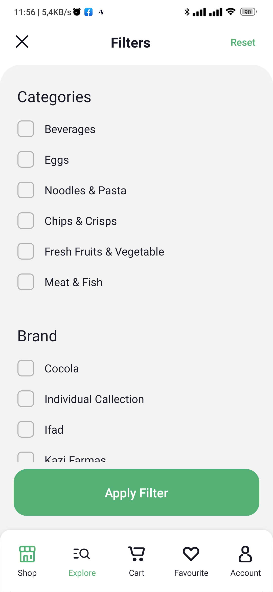 | 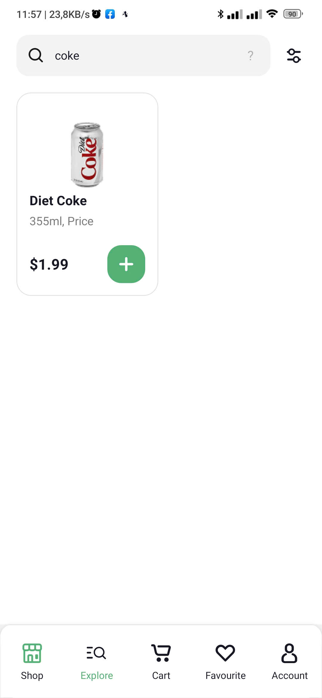 | 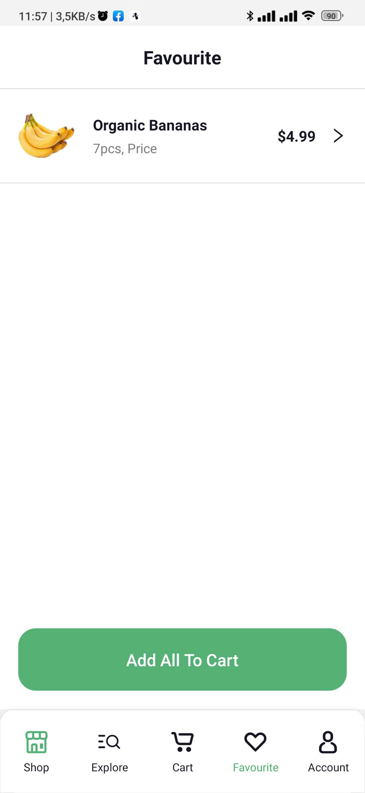 |
| :----------------------------------------------------------------------: | :----------------------------------------------------------------------: | :------------------------------------------------------------------------: |
|                              Filter Screens                              |                              Search Screens                              |                              Favourite Screen                              |

| 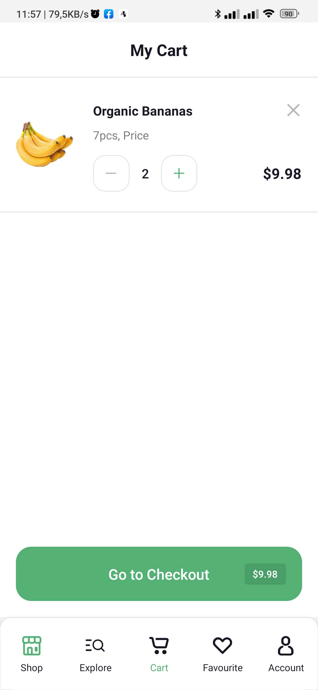 | 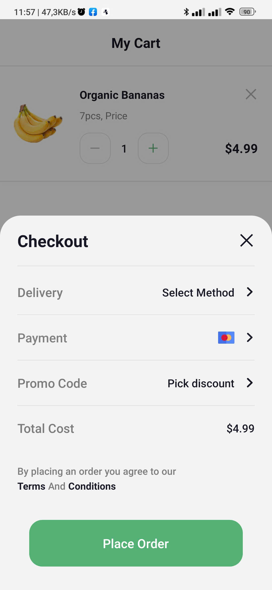 | 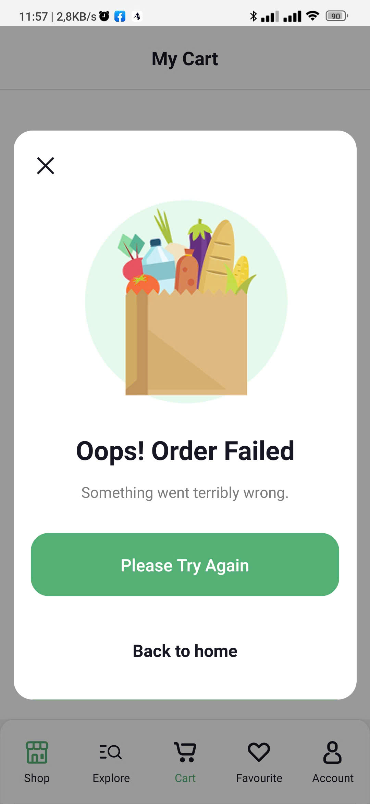 |
| :---------------------------------------------------------------------: | :-----------------------------------------------------------------------: | :--------------------------------------------------------------------: |
|                             My Cart Screen                              |                             Check Out Screen                              |                              Error Screen                              |

| 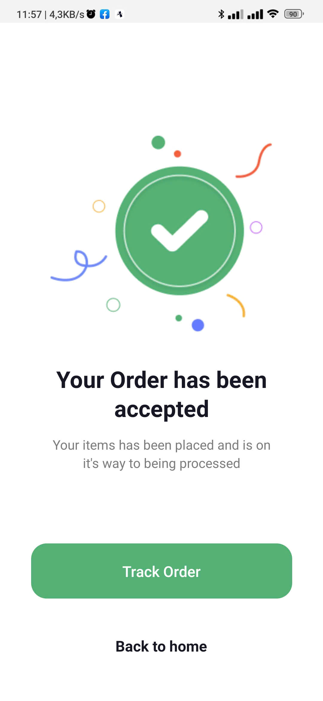 | 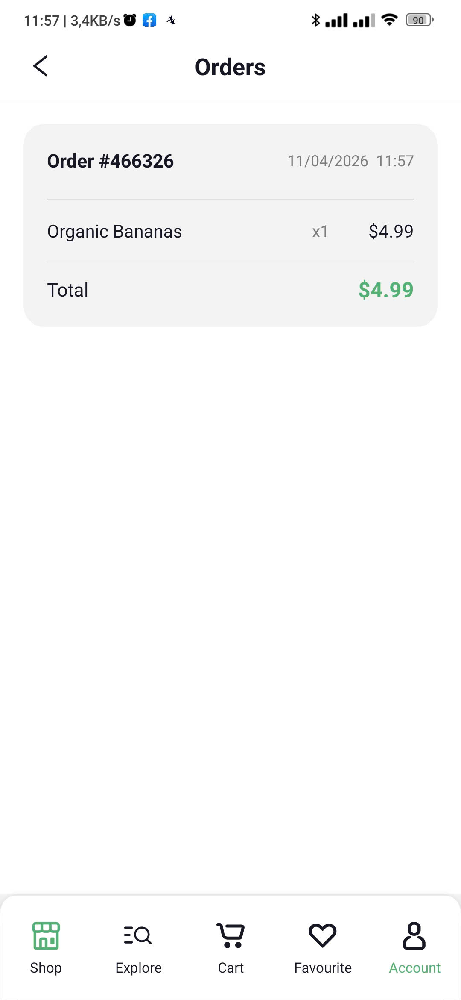 | 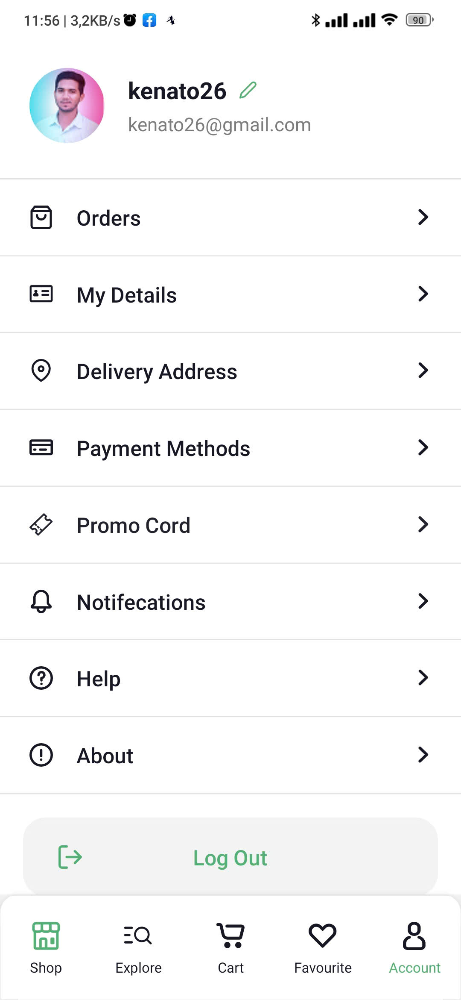 |
| :----------------------------------------------------------------------------: | :---------------------------------------------------------------------: | :----------------------------------------------------------------------: |
|                             Order Accepted Screen                              |                              Orders Screen                              |                              Account Screen                              |
