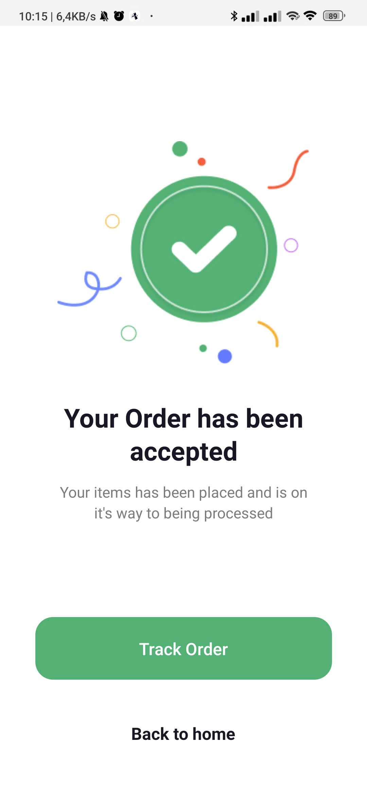
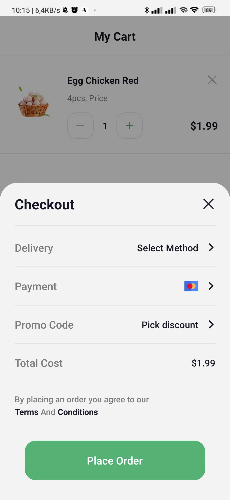
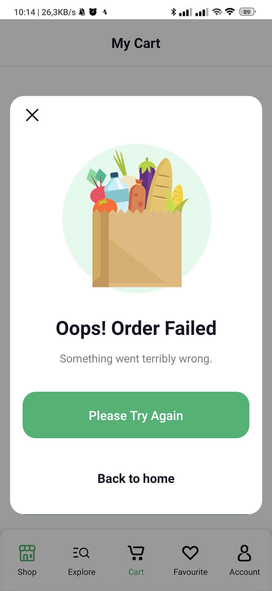
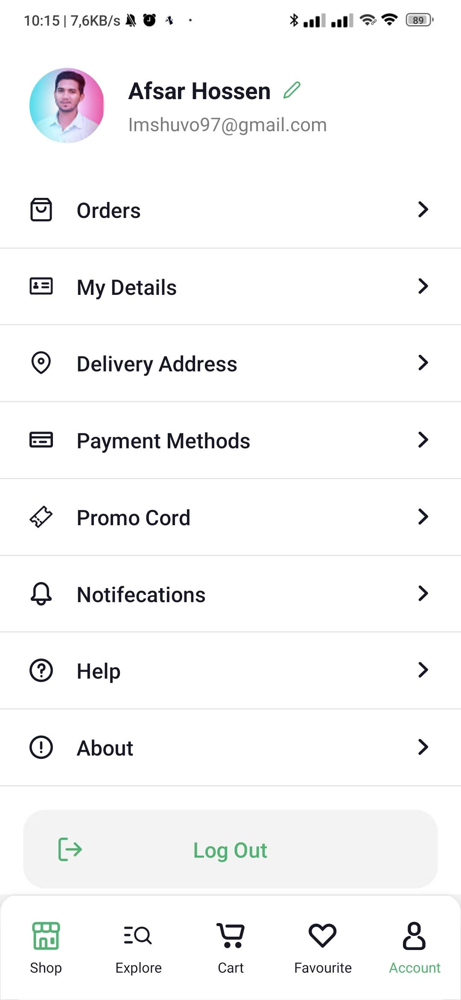

# 🛒 Online Groceries App - UI Implementation

🔗 **Figma Design:** [Online Groceries App UI (Community)](<https://www.figma.com/file/YJEth2cXrP27TFQMHVolYV/Online-Groceries-App-UI-(Community)?type=design&node-id=1-2&mode=design&t=a3qv9lcMb0Lpv4gL-0>)

---

**THÔNG TIN CÁ NHÂN:**

- **Họ và tên:** Nguyễn Hồng Đăng
- **Mã sinh viên:** 23810310039
- **Lớp** D18CNPM1

---

## CÁC GIAI ĐOẠN THỰC HÀNH (TIẾN ĐỘ)

### Ngày 4: Hoàn thiện tính năng thanh toán & Account

_Tham khảo yêu cầu tính năng: [Image Requirements](https://prnt.sc/4Ir7kSWd9x_d)_

**Nhiệm vụ - Xây dựng các màn hình:**

- **Checkout** (Xác nhận đơn hàng mở dạng khung Pop-up).
- **Order Accepted** (Xác nhận Đơn hàng gửi đi thành công).
- **Error** (Hiển thị Lỗi thao tác / Hoặc cảnh báo khi tổng giỏ hàng <= 0).
- **Account** (Tài khoản người dùng, tích hợp đăng xuất để clear App Data và Storage).

**Hiển thị kết quả (Screenshots):**

  
  
  
  

---

### Ngày 3: Tìm kiếm, Lọc & Quản lý Giỏ hàng/Yêu thích

_Tham khảo yêu cầu tính năng: [Image Requirements](https://prnt.sc/s4bECEoNXLyn)_

**Nhiệm vụ - Xây dựng các tính năng & màn hình:**

- **Search System** (Tìm kiếm sản phẩm).
- **Filter Screens** (Bộ lọc cho sản phẩm).
- **My Cart** (Giỏ hàng người dùng).
- **Favorites** (Kho lưu lại danh sách yêu thích).

**Yêu cầu đặc biệt:**
Tải danh sách sản phẩm từ tệp cấu trúc JSON `data.js`. Sử dụng Javascript xử lý mảng (danh sách) để thực hiện tính năng tìm kiếm, tìm nội dung chuỗi (string) và hiển thị động theo từ khóa của người dùng đã gõ.

**Hiển thị kết quả (Screenshots):**

  
  
  
  

---

### Ngày 2: Trang chủ, Khám phá & Chi tiết sản phẩm

_Tham khảo yêu cầu tính năng: [Image Requirements](https://prnt.sc/2o5-0Se9VjDu)_

**Nhiệm vụ - Xây dựng các màn hình:**

- **Home Screen** (Trang chủ hiển thị danh sách).
- **Product Detail** (Hiển thị Chi tiết và Mô tả sản phẩm).
- **Explore Main** (Tab khám phá danh mục hàng hóa chung).
- **Beverages Screens** (Danh mục con của nhóm Nước giải khát).

**Hiển thị kết quả (Screenshots):**

  
  
  
  
  
  

---

### Ngày 1: Đăng nhập & Xác thực (Auth)

_Tham khảo yêu cầu sơ bộ: [Image Requirements](https://prnt.sc/y_gyMT-xafJw)_

**Nhiệm vụ - Xây dựng luồng đăng nhập:**
Xây dựng luồng Auth Navigation với bao gồm các màn Splashes, Onboarding, SignIn, SignUp, Location, và Verification...

**Hiển thị kết quả (Screenshots):**

  
  
  
  
  
  
  
  

