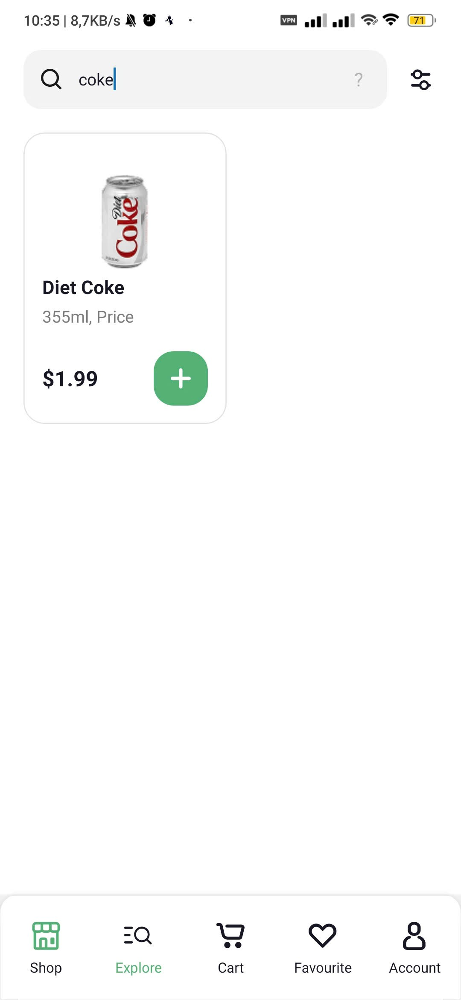
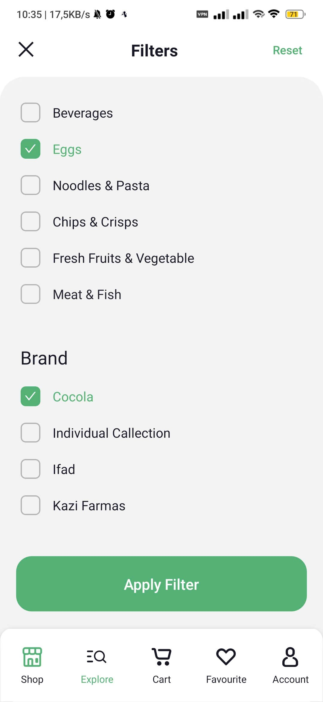
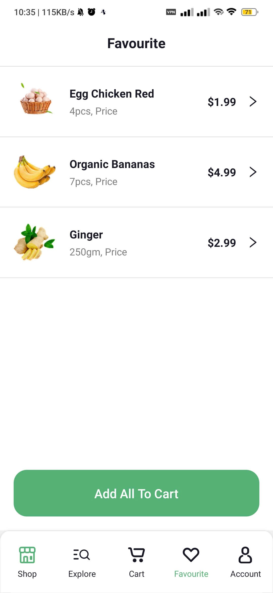
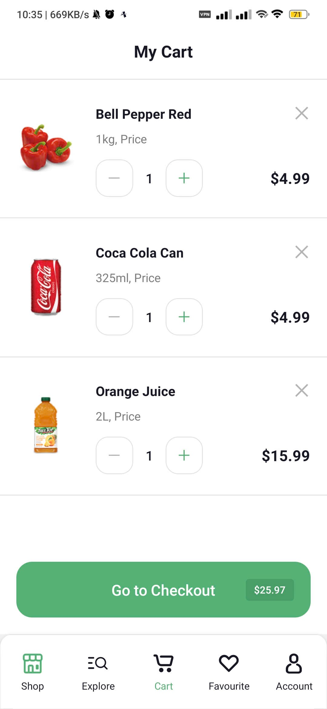
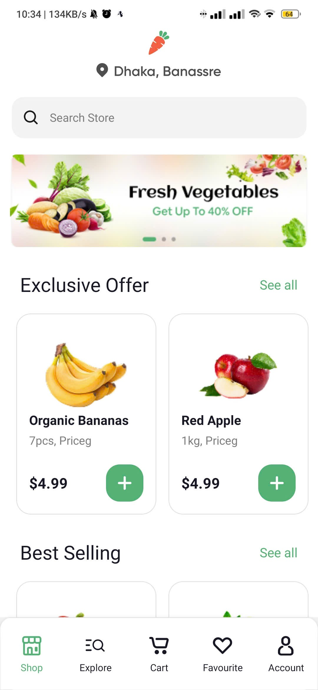
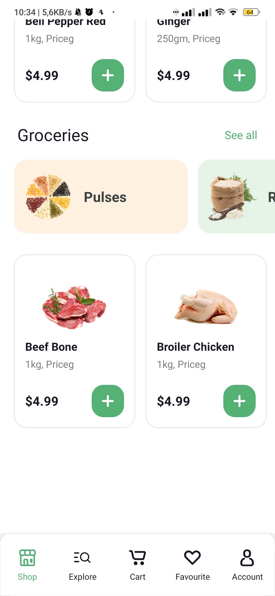
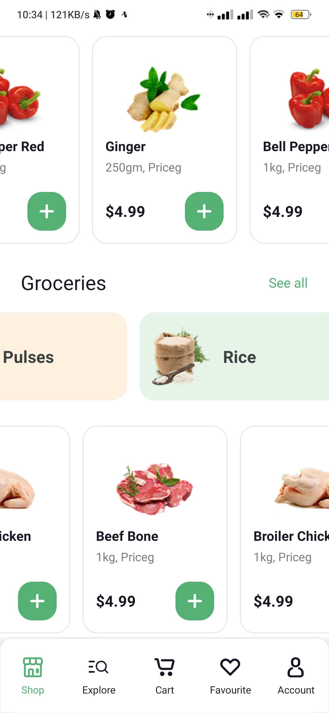
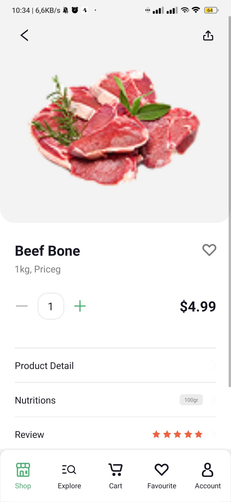
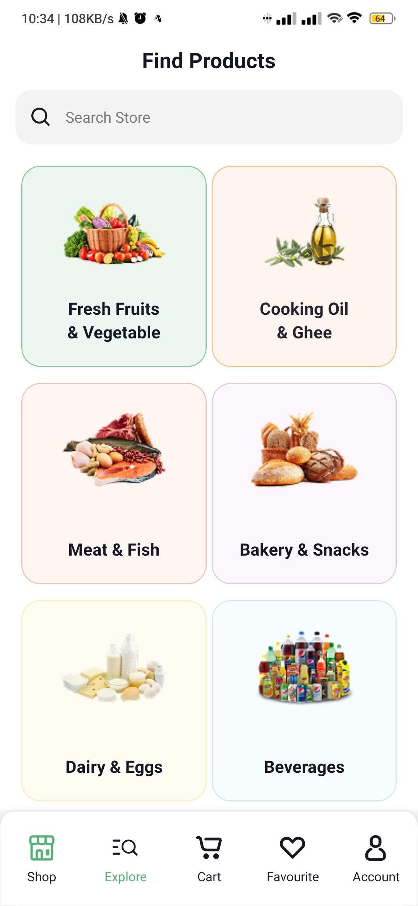
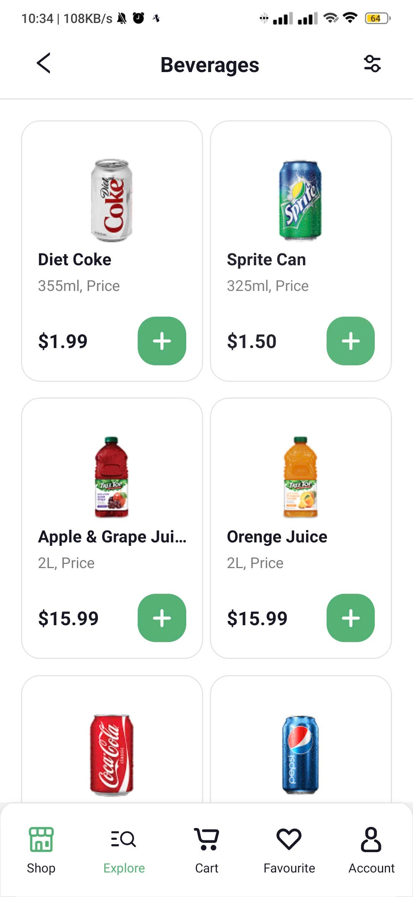

Hoàn thành các màn hình sau: https://prnt.sc/y_gyMT-xafJw

Theo thiết kế figma: https://www.figma.com/file/YJEth2cXrP27TFQMHVolYV/Online-Groceries-App-UI-(Community)?type=design&node-id=1-2&mode=design&t=a3qv9lcMb0Lpv4gL-0

thực hành ngày 3: 
Hoàn thành các màn hình sau: https://prnt.sc/s4bECEoNXLyn
- Search
- Filter
- MyCart
- Favorites
Theo thiết kế figma: https://www.figma.com/file/YJEth2cXrP27TFQMHVolYV/Online-Groceries-App-UI-(Community)?type=design&node-id=1-2&mode=design&t=a3qv9lcMb0Lpv4gL-0

Yêu cầu:

    Tải danh sách sản phẩm từ file "data.js" lưu trữ cấu trúc json danh sách sản phẩm.
    Khi người dùng tìm kiếm thì sử dụng javascript để tìm kiếm trong danh sách để hiển thị.

result ngày 3:
   

Thực hành ngày 2:
Hoàn thành các màn hình sau: Home Screen, Product Detail, Explore, Beverages
https://prnt.sc/2o5-0Se9VjDu

Theo thiết kế figma: https://www.figma.com/file/YJEth2cXrP27TFQMHVolYV/Online-Groceries-App-UI-(Community)?type=design&node-id=1-2&mode=design&t=a3qv9lcMb0Lpv4gL-0

result ngày 2:
     

- result ngày 1:
  
  
  
  
  
  
  
  
