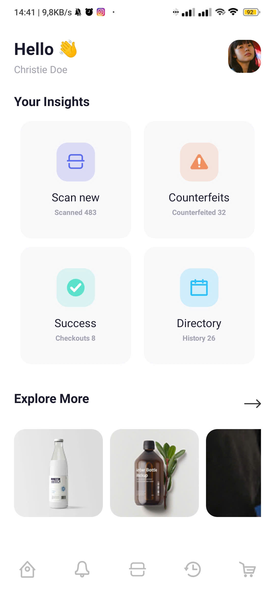
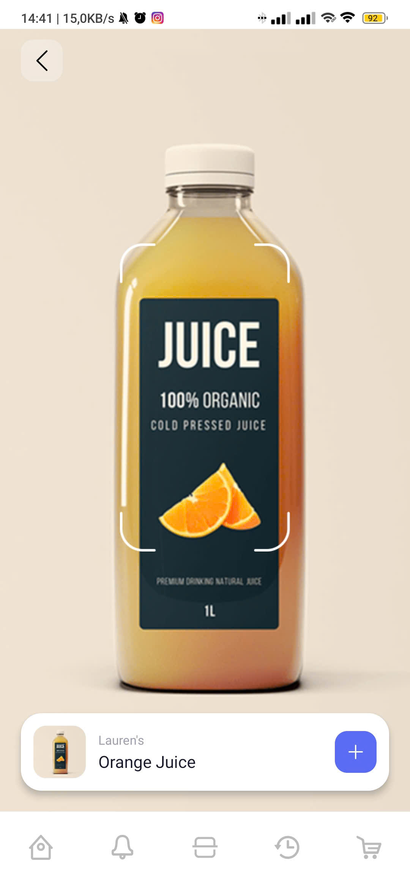
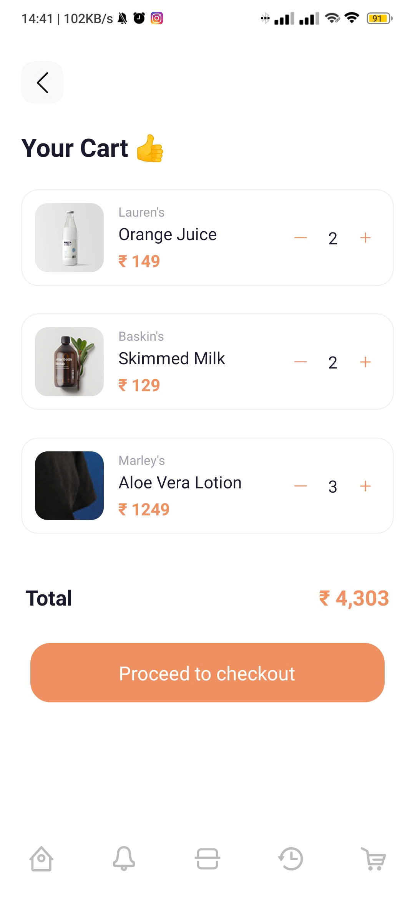

# Bar Code Scan App 📱

## Yêu cầu

**Link design:**
[Figma - Bar Code Scan App](https://www.figma.com/file/j7cET0s1hS3wvgIBb94sXs/Bar-Code-Scan-App-(Community)-(Copy)-(Copy)?node-id=14%3A1094&mode=dev)

**Nội dung:**

- Hoàn thiện layout các màn hình: Home, Scan, Cart
- Sử dụng Stack Navigator và Bottom Tabs Navigator để di chuyển giữa các Screens.
- Sử dụng AsyncStorage để hoàn thiện chức năng giỏ hàng.

## Kết quả

| Home Screen | Scan Screen | Cart Screen | Cart Screen (scroll) |
|:-----------:|:-----------:|:-----------:|:--------------------:|
|  |  |  |  |
